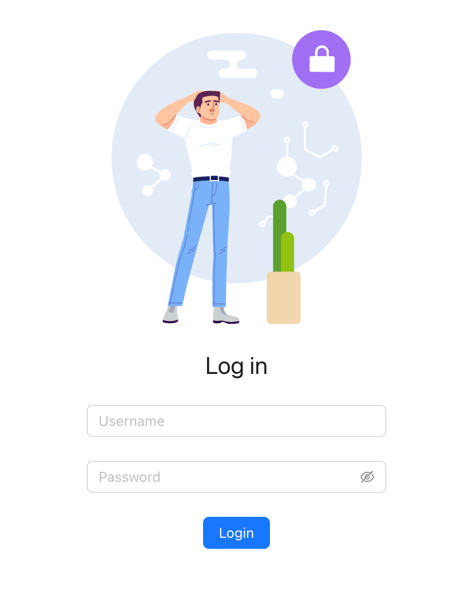

This is a [Next.js](https://nextjs.org/) project bootstrapped with [`create-next-app`](https://github.com/vercel/next.js/tree/canary/packages/create-next-app).

Here you can find the small example of the login app, which I called the **"Tiny Login App"**. 

Note, that there is no any API calls, so the data is not saved anywhere. The app is just for the demo purposes.



## Getting Started

First, run the development server:

```bash
npm run dev
# or
yarn dev
# or
pnpm dev
```

Open [http://localhost:1310](http://localhost:3000) with your browser to see the result.

On the root page `/` you can see the login form. You can enter any email and password.
After the success login, You'll be redirected to the `/profile` page. 
This page is available only for the logged in users. If you try to open it without the login, you'll be redirected to the login page.
